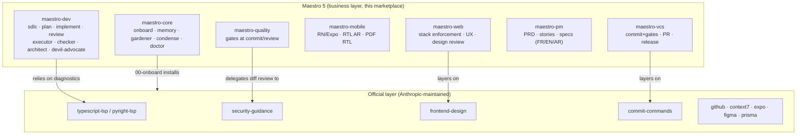

# Maestro 5 — Architecture

## Composition



## Where quality runs (the core design decision)

| Moment | What runs | Owner |
|---|---|---|
| While Claude edits | LSP diagnostics (real-time), security-guidance diff review | **Official plugins** |
| Between implement phases | Acceptance-criteria assertion | maestro-dev:02-implement (skill gate) |
| Before commit | Secret detection + quality-gate level | maestro-vcs:00-commit (skill gate) |
| Before ship | Independent review with evidence | checker agent (opus) |
| Bash commands | Pure security guard (<20ms) | bash-guard hook |
| Session start | Memory reference sync (<100ms) | memory-sync hook |

**Nothing else runs automatically. Ever.** (Philosophy rules #1–3.)

## Feature lifecycle & persistent state

```
maestro_docs/tasks/<yyyy_mm_dd>_<slug>/
├── spec.md          # what & why (from maestro-pm or inline)
├── plan.md          # frontmatter: status: pending|in-progress|implemented|reviewed|blocked
├── phase-1.md       # frontmatter: status: pending|in-progress|done
├── phase-2.md
└── review.md        # checker verdict + evidence
```

Any session resumes by reading the task folder — no context is lost between
sessions (Philosophy rule #6).

## Plugin anatomy

```
plugins/<name>/
├── .claude-plugin/plugin.json   # manifest (required)
├── README.md
├── skills/<NN>-<name>/
│   ├── SKILL.md                 # contract: frontmatter + actions table + rules (+ !`live state`)
│   ├── actions/<NN>-<name>.md   # atomic, each with a ## Test section (router skills)
│   ├── assets/                  # templates (optional)
│   ├── references/              # extended docs (optional)
│   └── scripts/                 # executables a skill injects, e.g. 00-commit/scripts/secret-scan.sh
├── references/                  # plugin-level; maestro-core/references/routing.md is READ BY THE HOOK
├── commands/<name>.md           # slash commands (maestro-core: /maestro)
├── agents/<name>.md             # model-pinned agents, role: reviewer|builder|advisor
└── hooks/hooks.json             # only core & quality have one
```
